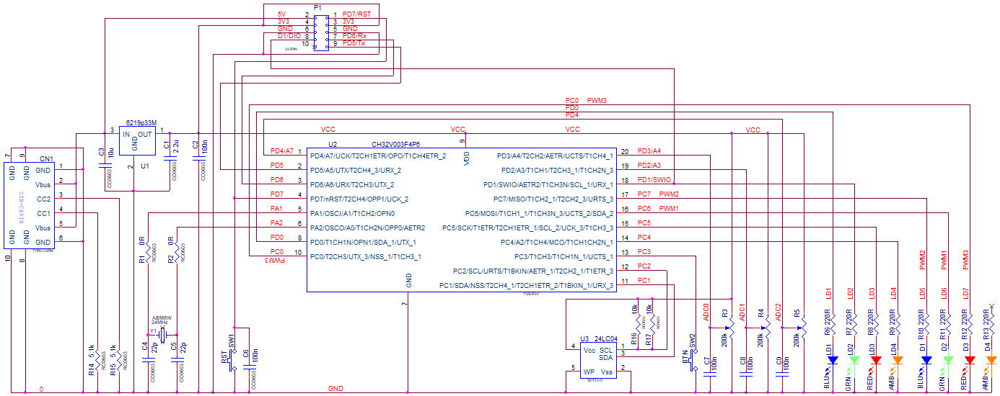

# CH32V003 test

This [MounRiver](http://www.mounriver.com/) project example shows **SysTick** interrupt, **GPIO**, **ADC**&**DMA**, DMA interrupt, **PWM**, button reading, **Option** area flash, **persistent** (non initialize) variables, **Watchdog**, **UART** cyclic buffered IO with *printf*, **FLASH** memory for user data and **PD7/nRST**&**PD1/SWIO** as *GPIO* usage (commented in `void GPIO_INIT(void)`).

The following files are modified:  

- *ch32v00x_flash.c* & *ch32v00x_flash.h* (`void FlashOptionData(uint8_t data0, uint8_t data1);` and `void FlashOptionUser(uint16_t user);` added).

- ch32v00x_gpio.c & ch32v00x_gpio.h (bit manipulation functions declared as **inline**).

- *Link.ld* (sections "**.no_init**" and "**.eesegment**" added).

Pins usage (CH32V003F4P6_MINI EVB):

- PD7/nRST,
- PD6/Rx,
- PD5/Tx,
- PD4/AN7,
- PD0/LD1,
- PD1/SWIO/LD2,
- PC1/SDA,
- PC2/SCL,
- PC5/LD3,
- PA1/XTAL1,
- PA2/XTAL2,
- PD3/AN4,
- PD2/AN3,
- PC4/LD4,
- PC7/PWM(T1CH2)/LD5,
- PC6/PWM(T1CH1)/LD6,
- PC0/PWM(T1CH3)/LD7.

Circuit diagram :

At start, the program prints the **Clock frequency**, **Chip ID**, **User Options** (determ the **PD7** usage), the number of reboots stored in the **User Options** area and then performs a series of erases and writes to flash memory. At the first start, there is an array specified in the program from 00 to 0f. Next, the specified sector (64 bytes) is erased and data from 3f down to 00 is written there. At the next start, they will be read.

Then the program constantly prints to the **UART** (115200, 8, N, 1) the value of three filtered analog channels and the *Vref* (1.2V) channel and the **DMA** transfer counter per 100ms (if some value changes). Also prints terminal echo. LD5, LD6, LD7 shows PWMs corresponded with analog inputs. When you short press the button (up to 500ms), three bits of the button release counter are displayed on LD1..LD3. When the program starts, the reset counter saved in **Data0** of the **Option** bytes is printed. Reset button if **PD7** enabled suppress watchdog feeding and cause MCU reset.

EEPROM test demonstrate **IIC** operation with 24LC04 I2C serial EEPROM. 
